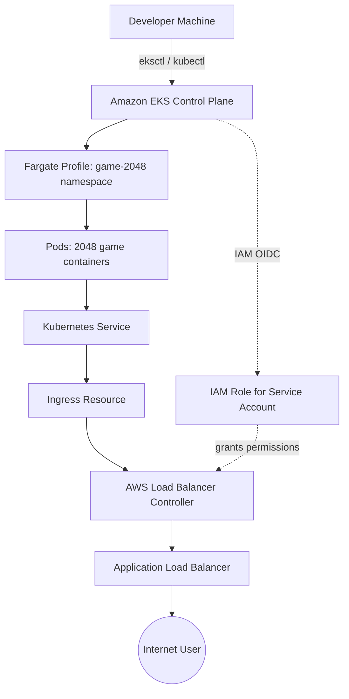

# 🎮 EKS End-to-End: Deploying 2048 Game on Amazon EKS with ALB Ingress

A complete, beginner-friendly, hands-on project that takes you from **zero to a publicly accessible Kubernetes app on AWS EKS** — using Fargate (no worker node management), the AWS Load Balancer Controller, and an Ingress-based Application Load Balancer.

> If you can copy-paste commands, you can complete this project in under an hour.

---

## 📌 What You'll Build

```
Internet
   │
   ▼
Application Load Balancer  (created automatically by ALB Controller)
   │
   ▼
Ingress (game-2048 namespace)
   │
   ▼
Service (ClusterIP)
   │
   ▼
Pods running the 2048 game (on Fargate — no EC2 nodes to manage)
```

By the end, you'll have the classic **2048 puzzle game running live on the internet**, served through a real AWS Application Load Balancer, on a serverless Kubernetes cluster.

---

## 🗺️ Architecture



**Key components:**

| Component | Purpose |
|---|---|
| **EKS Cluster (Fargate)** | Managed Kubernetes control plane; Fargate removes the need to provision/manage EC2 worker nodes |
| **Fargate Profile** | Tells EKS which namespace(s) should run on Fargate |
| **IAM OIDC Provider** | Lets Kubernetes ServiceAccounts assume IAM roles (IRSA) |
| **AWS Load Balancer Controller** | A Kubernetes controller that watches Ingress/Service objects and provisions real AWS ALBs/NLBs |
| **Ingress** | Kubernetes object that tells the ALB Controller how to route traffic |
| **2048 App** | Sample game deployment used to prove the whole pipeline works end-to-end |

---

## ✅ Prerequisites

Install these on your local machine before starting. Full details in [`docs/01-prerequisites.md`](docs/01-prerequisites.md).

| Tool | Purpose |
|---|---|
| [AWS CLI](https://docs.aws.amazon.com/cli/latest/userguide/cli-chap-install.html) | Talk to AWS APIs |
| [kubectl](https://kubernetes.io/docs/tasks/tools/install-kubectl/) | Talk to the Kubernetes API |
| [eksctl](https://eksctl.io/installation/) | Simplifies creating/deleting EKS clusters |
| [helm](https://helm.sh/docs/intro/install/) | Install the ALB Controller |
| An AWS account with an IAM user configured via `aws configure` | Auth |

> 💡 Also want to practice locally first? You can sanity-check your manifests on **Minikube** before touching AWS:
> ```bash
> minikube start --driver=docker
> ```

---

## 🚀 Quick Start (All Commands)

If you just want to run the whole thing top to bottom, here it is. For explanations of *why* each step exists, read the linked docs.

```bash
# 1. Create the EKS cluster (Fargate = no worker nodes to manage)
eksctl create cluster --name demo-cluster --region us-east-1 --fargate

# 2. Update local kubeconfig to point at the new cluster
aws eks update-kubeconfig --name demo-cluster --region us-east-1

# 3. Create a Fargate profile scoped to the app's namespace
eksctl create fargateprofile \
    --cluster demo-cluster \
    --region us-east-1 \
    --name alb-sample-app \
    --namespace game-2048

# 4. Deploy the sample 2048 app (Deployment + Service + Ingress)
kubectl apply -f https://raw.githubusercontent.com/kubernetes-sigs/aws-load-balancer-controller/v2.5.4/docs/examples/2048/2048_full.yaml

# 5. Associate an IAM OIDC provider with the cluster (required for IRSA)
eksctl utils associate-iam-oidc-provider --cluster demo-cluster --approve

# 6. Download & create the IAM policy the ALB Controller needs
curl -O https://raw.githubusercontent.com/kubernetes-sigs/aws-load-balancer-controller/v2.11.0/docs/install/iam_policy.json
aws iam create-policy \
    --policy-name AWSLoadBalancerControllerIAMPolicy \
    --policy-document file://iam_policy.json

# 7. Create an IAM role + Kubernetes ServiceAccount bound together (IRSA)
eksctl create iamserviceaccount \
  --cluster=demo-cluster \
  --namespace=kube-system \
  --name=aws-load-balancer-controller \
  --role-name AmazonEKSLoadBalancerControllerRole \
  --attach-policy-arn=arn:aws:iam::<YOUR_ACCOUNT_ID>:policy/AWSLoadBalancerControllerIAMPolicy \
  --approve

# 8. Install the ALB Controller via Helm
helm repo add eks https://aws.github.io/eks-charts
helm repo update eks
helm install aws-load-balancer-controller eks/aws-load-balancer-controller -n kube-system \
  --set clusterName=demo-cluster \
  --set serviceAccount.create=false \
  --set serviceAccount.name=aws-load-balancer-controller \
  --set region=us-east-1 \
  --set vpcId=<YOUR_VPC_ID>

# 9. Verify the controller is running
kubectl get deployment -n kube-system aws-load-balancer-controller

# 10. Get your public ALB URL
kubectl get ingress -n game-2048
```

Open the `ADDRESS` shown in step 10 in a browser — you should see the 2048 game 🎉

---

## 📖 Step-by-Step Guide (Detailed)

| Step | Doc |
|---|---|
| 1 | [Prerequisites](docs/01-prerequisites.md) |
| 2 | [Create the EKS Cluster](docs/02-cluster-setup.md) |
| 3 | [Configure the IAM OIDC Provider](docs/03-oidc-setup.md) |
| 4 | [Install the AWS Load Balancer Controller](docs/04-alb-controller.md) |
| 5 | [Deploy the 2048 Sample App](docs/05-deploy-app.md) |
| 6 | [Deploy a Generic Sample App (Nginx)](docs/07-generic-sample-app.md) |
| 7 | [Verify & Access the App](docs/06-verify-and-access.md) |
| 8 | [Clean Up (avoid AWS charges!)](docs/08-cleanup.md) |
| 9 | [Troubleshooting](docs/09-troubleshooting.md) |

---

## 🖼️ Result

Once deployed, you get a real Internet-facing Application Load Balancer:

- EC2 Console → Load Balancers shows a new **internet-facing ALB** (`k8s-game2048-ingress...`)
- `kubectl get ingress -n game-2048` shows the ALB's public DNS name as the `ADDRESS`
- Visiting that address in a browser loads the playable 2048 game

---

## 🧹 Important: Clean Up When Done

EKS clusters and Load Balancers **cost money every hour they run**. Always tear down in this order (see [docs/08-cleanup.md](docs/08-cleanup.md) for why order matters):

1. Delete the Ingress (so the ALB Controller removes the ALB) **or** just delete the namespace
2. Delete the cluster with `eksctl delete cluster`

```bash
kubectl delete namespace game-2048
eksctl delete cluster --name demo-cluster --region us-east-1
```

---

## 📂 Repository Structure

```
eks-2048-project/
├── README.md                      ← you are here
├── docs/
│   ├── 01-prerequisites.md
│   ├── 02-cluster-setup.md
│   ├── 03-oidc-setup.md
│   ├── 04-alb-controller.md
│   ├── 05-deploy-app.md
│   ├── 06-verify-and-access.md
│   ├── 07-generic-sample-app.md
│   ├── 08-cleanup.md
│   └── 09-troubleshooting.md
└── manifests/
    ├── deploy.yaml                ← generic sample app (nginx) Deployment
    └── service.yaml               ← generic sample app Service
```

---

## 🙌 Credits

Based on hands-on lab work following the AWS EKS + ALB Controller workflow, inspired by community resources including [iam-veeramalla/aws-devops-zero-to-hero](https://github.com/iam-veeramalla/aws-devops-zero-to-hero).

## 📄 License

MIT — feel free to fork, adapt, and use this for learning or interviews.
